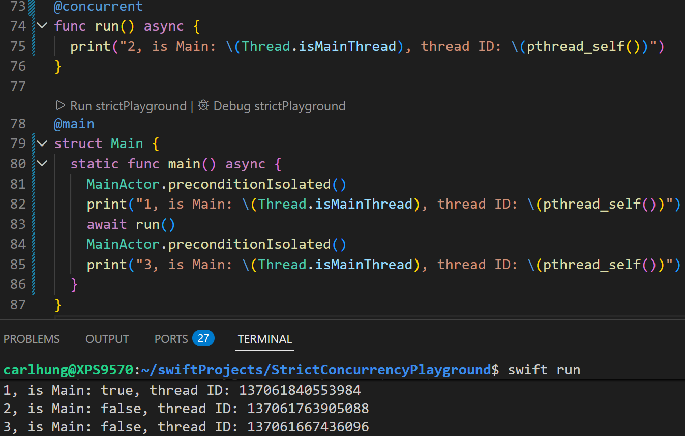
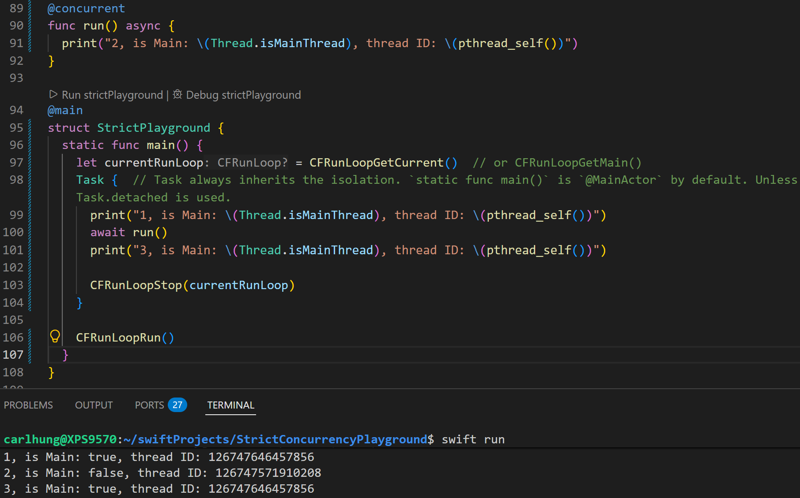

# Not returning to the main thread after suspension

I currently found a bug on linux. In the entry function `static func main`, by befault, it runs on `MainActor`. But after the first suspension, it doesn't return to main thread. 

Talked to people on the swift forum. It seems to happen on windows as well. But the following example and solution, I only used linux machine. As I don't have windows manchine.

`pthread_self()` returns the current thread ID.

But you can see, after the first suspension, it didn't return to the main thread. But it didn't crash. Because it ran on the correct MainActor executor.

I talked to the swift compiler contributors. I was told to looking at the swift compiler project. The issue is caused due to `dispatch_main()`, a function from `Grand Central Dispatch`. On Linux and Windows, the MainActor's executor will call `dispatch_main()` for the first time. But after the suspension point, the main thread will be destoryed. Therefore, it couldn't return to the main thread. 

On all apple's OSs, it has two executors for the main thread. One uses `Grand Central Dispatch`, one uses `CFRunLoop`. `CFRunLoop` is in `Core Foundation`. It is part of the default library in the OSs. Swift compiler will look for `Core Foundation` for the main executor. But on Linux and Windows, the swift language project only has the main executor which uses `dispatch_main`.

I don't think apple will fix it anytime soon. Because it may need to implement `CFRunLoop` from the scatch.

I am here to offer a soluation to fix this issue.
